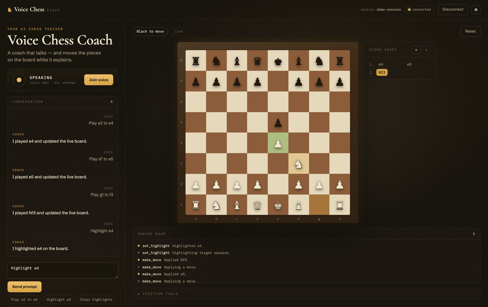
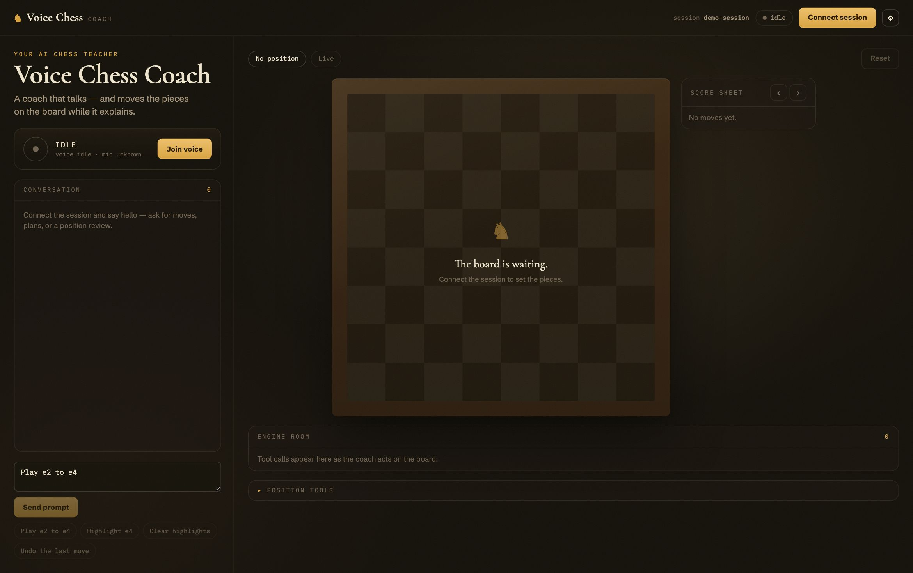
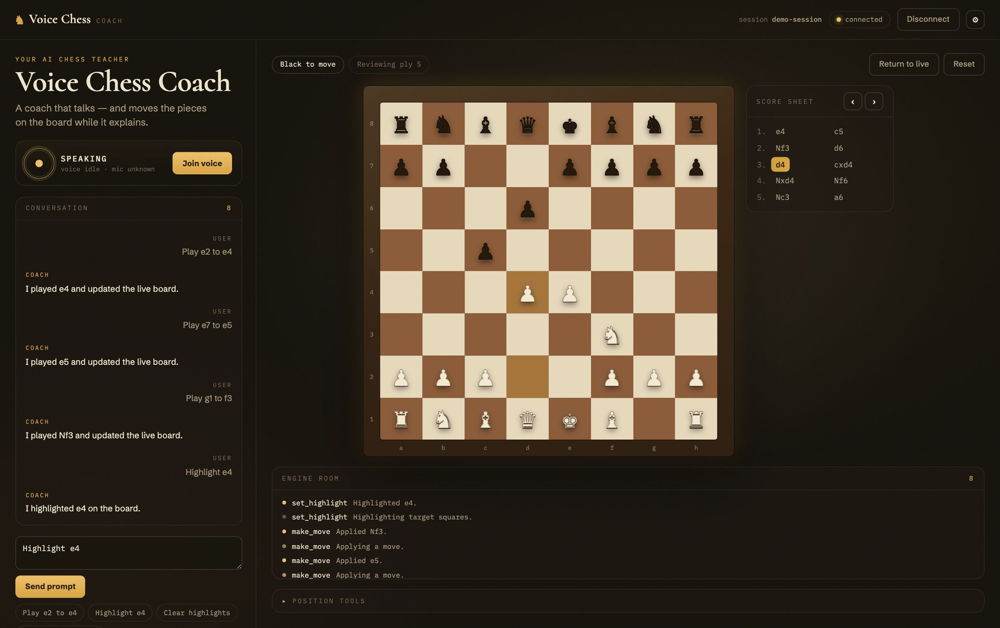

# Voice Chess Assistant

A voice chess coach that **talks and moves the pieces while it explains** —
like a teacher sitting next to you. Built as a reusable monorepo: a React
board UI plus a Python [Pipecat](https://github.com/pipecat-ai/pipecat)
backend that listens, reasons about the game (with a real engine), and
controls the board in sync with its own speech.



## What makes it different

The board follows the coach's **voice**, not its tool calls. The LLM writes
one continuous narration with inline markers (`[[move e2e4]]`), the TTS
returns word-level timestamps, and each action fires **on the exact word**
that names it — the same technique avatar lip-sync uses. No board changes
ahead of the audio, no dead pauses between moves, and interrupting the coach
cancels anything it didn't get to say. Design notes:
[docs/speech-action-sync.md](docs/speech-action-sync.md).

Other product features:

- **Real engine analysis**: an `analyze_position` tool runs Stockfish — the
  coach narrates, the engine calculates.
- **Game review**: load a PGN and the coach walks it move by move on the
  board, for both sides, exploring sidelines (`[[var ...]]`) without touching
  the recorded game.
- **Board-aware session start**: join voice with a loaded FEN and the coach
  analyzes *your* position; with a loaded PGN it offers to review *your*
  game; only a pristine board gets the built-in opening demo.
- **Two-way board**: move pieces by hand and the coach sees it and reacts.
- Spanish by default (voice, ears and prompts) — configurable per language.

## Screenshots

| The stage, waiting | Reviewing a loaded game |
| --- | --- |
|  |  |

## Quick start

Requirements: Python 3.12, `uv`, Node 20+, `pnpm`, and (optional but
recommended) a Stockfish binary for engine analysis:

```bash
brew install stockfish   # macOS — or: apt install stockfish
```

1. Install dependencies:

```bash
pnpm install
uv sync --project packages/voice-chess-server --extra voice --group dev
uv sync --project examples/server
```

2. Create the example server env file:

```bash
cp examples/server/.env.example examples/server/.env
```

3. Fill in the provider credentials in `examples/server/.env`:

```dotenv
VOICE_CHESS_LLM_PROVIDER=openai
VOICE_CHESS_LLM_MODEL=gpt-5-mini
VOICE_CHESS_STT_PROVIDER=deepgram
VOICE_CHESS_TTS_PROVIDER=cartesia
VOICE_CHESS_OPENAI_API_KEY=...
VOICE_CHESS_DEEPGRAM_API_KEY=...
VOICE_CHESS_CARTESIA_API_KEY=...
VOICE_CHESS_CARTESIA_VOICE_ID=...   # pick a voice matching VOICE_CHESS_LANGUAGE
VOICE_CHESS_CARTESIA_MODEL=sonic-3
VOICE_CHESS_LANGUAGE=es             # TTS + prompt language
VOICE_CHESS_STT_LANGUAGE=multi      # Deepgram nova-3 multilingual
```

> `gpt-5-mini` is the recommended model: it follows the narration-marker
> protocol reliably. `gpt-5-nano` is faster but breaks the speech-synced
> choreography.

4. Start the backend:

```bash
uv run --project examples/server uvicorn voice_chess_example_server.main:app --host 0.0.0.0 --port 7860
```

5. Start the web example in another terminal:

```bash
pnpm --filter @voice-chess/example-web dev
```

## Using the app

1. **Connect session** (top right) — the board assembles and the session is
   live. Everything below works without voice credentials except step 2.
2. **Join voice** — grant the microphone and the coach greets you. On a
   fresh board it walks through a demo opening, moving each piece on the
   word that names it.
3. **Talk to it**: ask for moves, plans, openings, or "¿quién está mejor?".
   Interrupt it any time — unspoken moves never reach the board.
4. **Load your game**: open *Position tools* under the board, paste a PGN
   and press *Review from start*. The coach acknowledges it and reviews it
   on the board — both sides, sidelines included. The score sheet on the
   right navigates by move.
5. **Load a position**: paste a FEN and press *Load FEN*. The coach runs the
   engine and explains who stands better and each side's plan.
6. **Move pieces yourself**: click a piece, then a target square. The coach
   sees your move and comments on it.
7. The **Engine room** panel shows every board action as it fires — tool
   calls and narration markers alike.

The prompt composer (left) types to the same live coach when voice is
connected; without voice it falls back to a deterministic demo bot used by
the e2e tests.

## Configuration reference

All settings are env vars prefixed `VOICE_CHESS_` (see
[`Settings`](packages/voice-chess-server/voice_chess_server/core/config.py)):

| Variable | Default | Purpose |
| --- | --- | --- |
| `LLM_MODEL` | `gpt-5-mini` | OpenAI model; GPT-5 family gets `reasoning_effort=minimal`, `verbosity=low` automatically |
| `LLM_REASONING_EFFORT` / `LLM_VERBOSITY` | auto | Override the GPT-5 latency knobs |
| `LANGUAGE` | `es` | TTS synthesis language (also steers prompts) |
| `STT_LANGUAGE` | `multi` | Deepgram language (`multi` = code-switching) |
| `STOCKFISH_PATH` | `stockfish` | UCI engine binary for `analyze_position` |
| `ENGINE_ANALYSIS_DEPTH` | `14` | Engine search depth |
| `SPEECH_PACING_ENABLED` | `true` | Hold tool-driven board changes until the voice lands |
| `NARRATED_ACTIONS_ENABLED` | `true` | Inline `[[...]]` markers fired on word timestamps |
| `AUTO_START_DEMO_ON_VOICE_CONNECT` | `false` (`true` in the example) | Opening demo on a pristine board |
| `LOG_FILE` | unset | Tee structlog + pipecat logs to a file for diagnosis |

## Workspace layout

- `examples/web` — the example web app (Vite + React)
- `examples/server` — runnable backend wrapper
- `packages/voice-chess-react` — reusable React library (provider, hooks, board)
- `packages/voice-chess-core` — shared protocol package (types, JSON schemas, fixtures)
- `packages/voice-chess-server` — reusable FastAPI + Pipecat backend library
- `packages/voice-chess-testkit` — shared Python test helpers
- `tests/e2e` — Playwright coverage for the example flow

Package managers: `pnpm` for Node workspaces, `uv` for Python workspaces.

## How to extend the library

### Frontend

Compose your own UI around `VoiceChessProvider`, the board primitives, and the
voice transport controls:

```tsx
import {
  VoiceChessBoard,
  VoiceChessProvider,
  VoiceChessVoiceControls,
  useVoiceChessSession,
} from "@voice-chess/react";

function Toolbar() {
  const { connectionStatus, resetBoard } = useVoiceChessSession();
  return (
    <div>
      <span>{connectionStatus}</span>
      <button onClick={resetBoard}>Reset</button>
    </div>
  );
}

export function App() {
  return (
    <VoiceChessProvider
      boardSocketUrl="ws://localhost:7860/ws/sessions"
      signalingApiUrl="http://localhost:7860"
      sessionId="analysis-session"
      autoConnect={false}
    >
      <Toolbar />
      <VoiceChessVoiceControls />
      <VoiceChessBoard />
    </VoiceChessProvider>
  );
}
```

### Backend

`create_app()` accepts a `Settings` instance and an `orchestrator_factory`,
so you can swap prompts, providers or tool registration without editing the
library package in place:

```python
from voice_chess_server import create_app
from voice_chess_server.core.config import Settings
from voice_chess_server.services.orchestrator import BotOrchestrator


class MyOrchestrator(BotOrchestrator):
    pass


settings = Settings(
    tts_provider="cartesia",
    stt_provider="deepgram",
    llm_provider="openai",
)

app = create_app(
    settings=settings,
    orchestrator_factory=lambda settings, session_manager: MyOrchestrator(
        settings=settings,
        session_manager=session_manager,
    ),
)
```

The main extension seams:

- `Settings` for provider and runtime configuration
- `BotOrchestrator` for LLM/STT/TTS wiring, tools and narration markers
- `SessionManager` for canonical board state and domain events
- `VoiceChessProvider` for browser signaling and unified board + voice session state
- `@voice-chess/core` for the cross-platform protocol contract

## Documentation

- [docs/setup.md](docs/setup.md)
- [docs/architecture.md](docs/architecture.md)
- [docs/integration.md](docs/integration.md)
- [docs/speech-action-sync.md](docs/speech-action-sync.md) — how speech and
  board stay in sync, and the research behind it
